## Overview

To register an Azure service account in Cloudforet, you need the four settings information below.

- **Subscription ID**
- **Tenant ID**
- **Client ID**
- **Client Secret**

>💡 Before starting the setup guide, please make sure **Subscription ID** has been created.
See the Azure Subcription Guides [Azure Documentation](https://docs.microsoft.com/en-us/azure/cloud-adoption-framework/ready/azure-best-practices/initial-subscriptions)
 

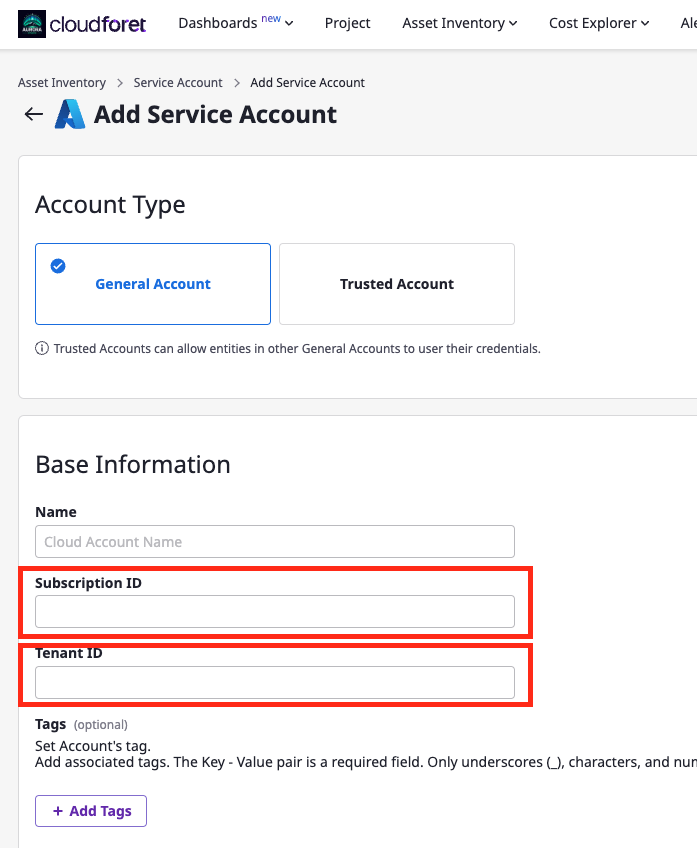

This setup guide will take a closer look at what the above-mentioned information means and where to obtain it.

 

### Subscription ID

Azure manages costs and resources in units of objects called subscriptions.
The **unique identifier** that distinguishes this is **Subscription ID**.
See the Subscription [Azure Documentation](https://docs.microsoft.com/en-us/azure/developer/intro/azure-developer-billing#what-is-an-azure-subscription)

 

### Tenant ID

**Tenant ID** is a **unique identifier** for your organization provided by Azure Active Directory (AD).
Azure AD is a cloud-based identity and access management service that you use to manage users on an organizational basis.
See the Azure AD [Azure Documentation](https://docs.microsoft.com/en-us/azure/active-directory/fundamentals/active-directory-whatis)

 

### Client ID

**Client ID** is the Application ID issued when creating an Azure app.
You use Azure App to manage credentials and IAM users for your applications.
See the Azure App [Azure Documentation](https://docs.microsoft.com/en-us/azure/active-directory/develop/quickstart-register-app)

 

### Client Secret

This is the **Client Secret** key that can be obtained through Azure App registration.
Required when using Azure's API and issuing tokens to access resources.

 

We briefly discussed the concept of setup information required when registering a Cloudforet Azure service account.
Now, let's learn more about **how to actually obtain configuration information** in the next lesson.

 

## Overall Flow

Cloudforet supports the **[azure_client_secret]** method through issuing authentication keys for integration with Azure.
The method using **[azure_client_secret]** requires the following setting information.

- **Subscription ID**
- **Tenant ID**
- **Client ID**
- **Client Secret**

To obtain the above information, please proceed with the settings in the following order.

1. [App Registration](#1-App-Registration)
2. [Create resource group](#2-Resource-Group-Create)
3. [Grant Role](#3-Role-Grant)
4. [Authentication key generation](#4-Authentication key-generation)
5. [Confirm Subscription](#5-Subscription-Confirm)
6. [Service account registration](#6-Service-Account-Registration)
7. [Add custom role (select)] (#7-user-specified-role-add-select)

 
 

## 1-App-Registration

You can obtain **[Client ID]** settings information in Azure through app registration.
If there is already a registered app, it can be omitted.

(1) Log in to [Azure Portal](https://portal.azure.com/#home).
(1-1) Enter ‘app registration’ in the search box and click [App registration].

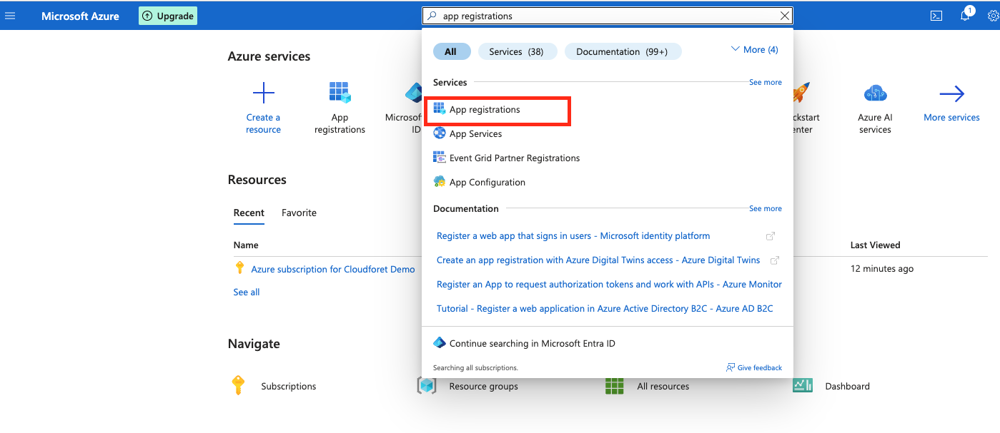

(1-2) Click the [New Registration] button.

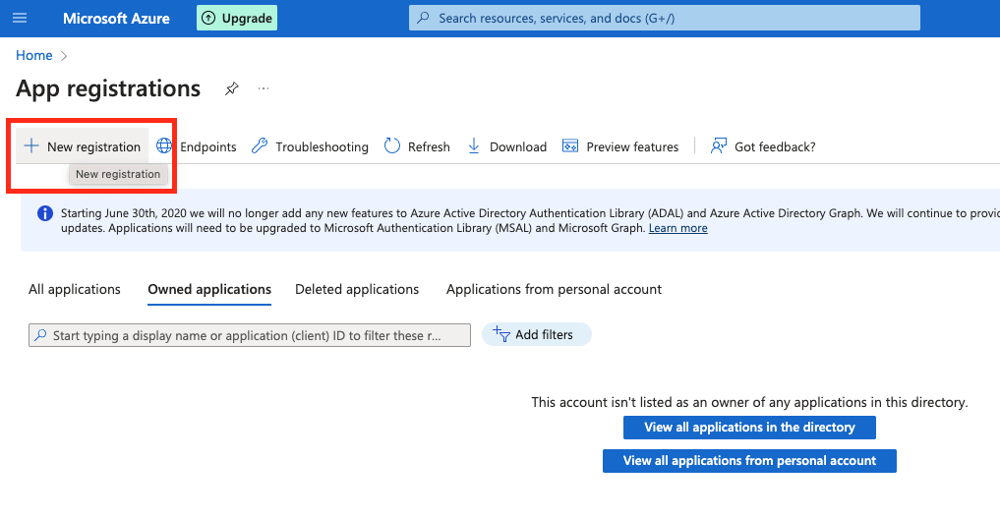

(2) Enter application registration information.
(2-1) Click [Only accounts in this organization directory].
You can click [Selection Guide] to select an account that can access the API that suits your organization's structure.
(2-2) Click the [Register] button.

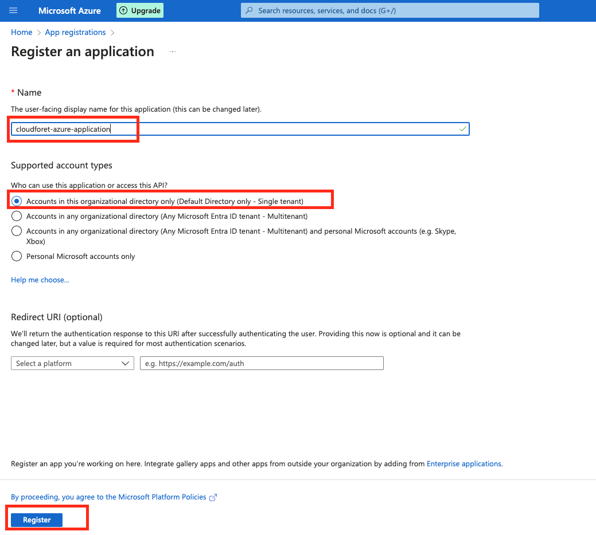

(3) You can check **[Client ID]** and **[Tenant ID]** setting information in the [Basic Information] menu.

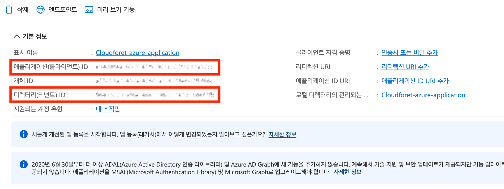

 
 

## 2. Create a resource group

A resource group is a group for managing resources being used in Azure.
You can have a 1:N relationship with your subscription.
If you have created a resource group, skip this step.

(1) Go to [Azure Portal](https://portal.azure.com/#home).
(1-1) Enter ‘resource group’ in the search box and click [Resource Group] in the service list.

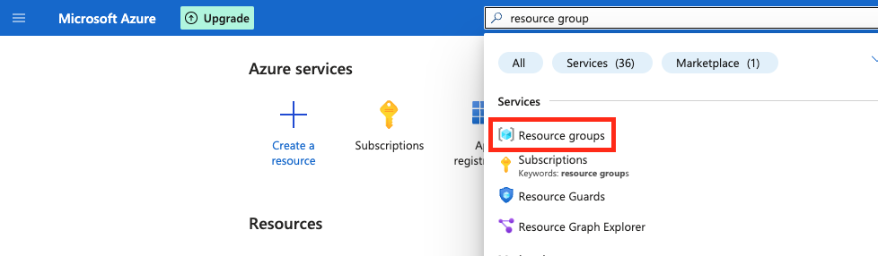

(2) Click the [Create] button.

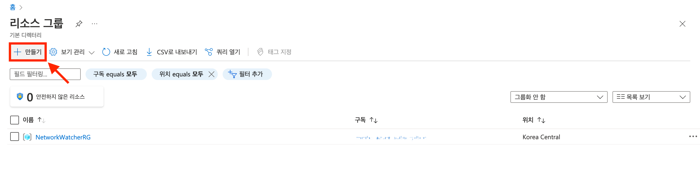

(3) After entering the project information, click the [Review + Create] button.
(3-1) Then click the [Create] button.

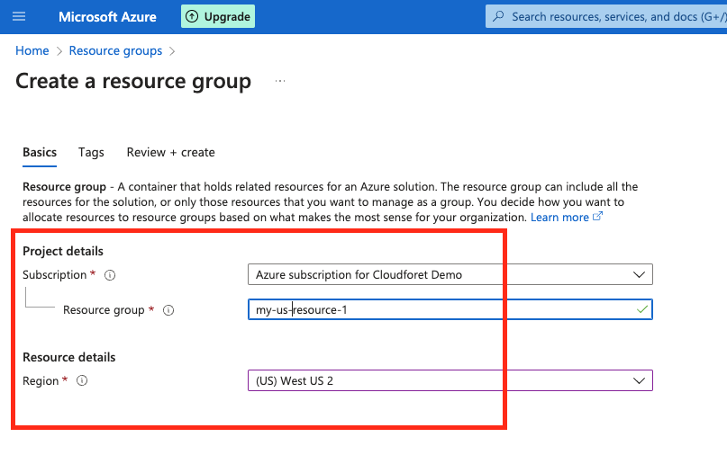

 
 

## 3. Assign roles

[Role](https://docs.microsoft.com/en-us/azure/role-based-access-control/role-definitions) is a collection of access permissions to Azure resources.
The Azure plugin requires a role setup with appropriate permissions to collect resource information.
> You can create a role with the required permissions by creating a custom role. 
> You can check how to create a custom role in [Course 7] (#7-User-Role-Assignment-Add-Select).

The collector plugin does not require any permissions other than read permission.
The permission information required for each plugin is as follows.

| Plugin                                   | URL |
|------------------------------------------| --- |
| Microsoft Azure Cloud Service Collector  | https://github.com/cloudforet-io/plugin-azure-inven-collector#authentication-overview |

The process of granting permission in Azure for the plugin to collect resources is as follows:

1. Assign roles to subscriptions
2. Grant roles to resource groups

(1) This is the process of assigning roles to subscriptions.
(1-1) Go to [Azure Portal](https://portal.azure.com/#home).
(1-2) Enter ‘Subscription’ in the search box and click [Subscription] in the service list.

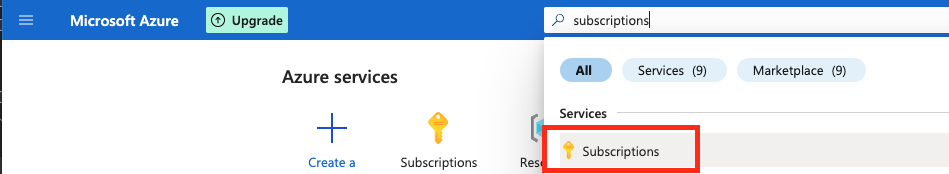

(1-3) Click the subscription you want to grant a role to.

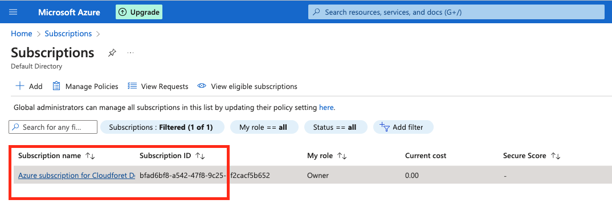

(1-4) Click the [Access Control (IAM) > Add > Add Role Assignment] button.

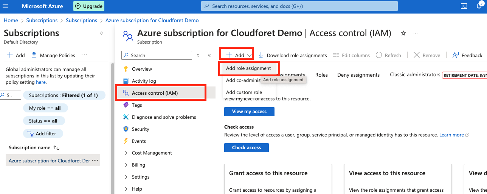

(1-5) Click the [Reader] role and then click the [Next] button.

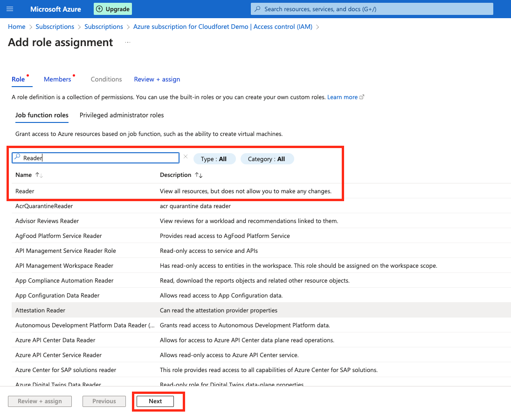

(1-6) Click the [Select Member] button to select an application as a member.
(1-7) After adding members, click the [Select] button.
Click the Review + Assign button when it becomes active.

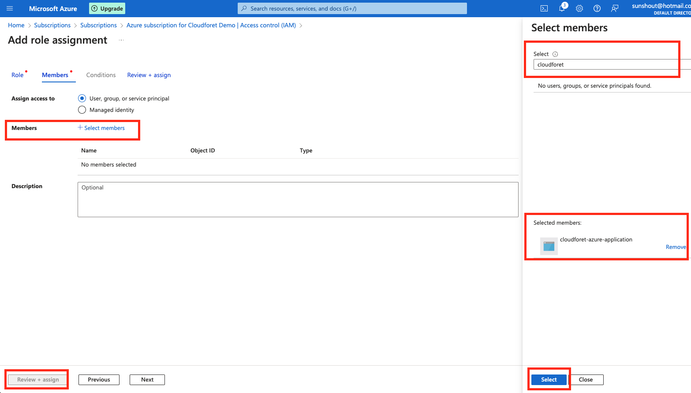

>💡 Please select the application with the corresponding icon.
> 

 

(2) This is the process of assigning roles to resource groups.
If you only want to collect resources from a specific resource group that belongs to your subscription, you must grant a role to that resource group.
If you have assigned a role to your subscription, you can skip this step.

(2-1) Log in to [Azure Portal](https://portal.azure.com/#home).
(2-2) Enter ‘resource group’ in the search box and click [Resource Group] in the service list.

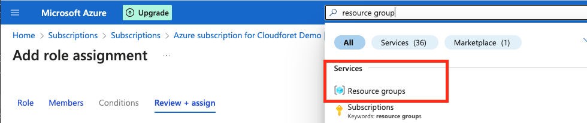

(2-3) Click the resource group you want to grant permission to.
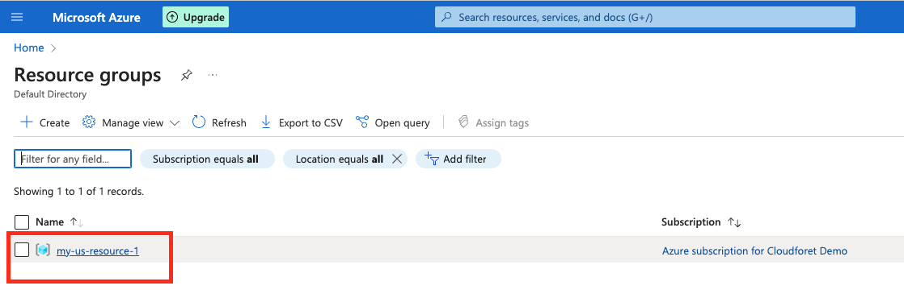

(2-4) Click the [Access Control (IAM) > Add > Add Role Assignment] button to start setting access permissions.

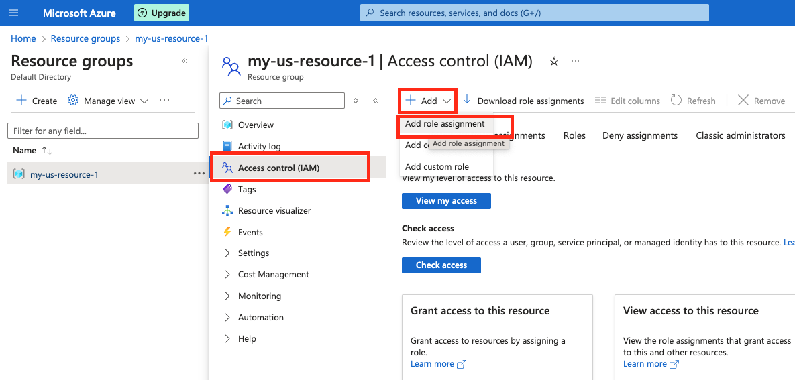

(2-5) Select the [Reader] permission and click the [Next] button.

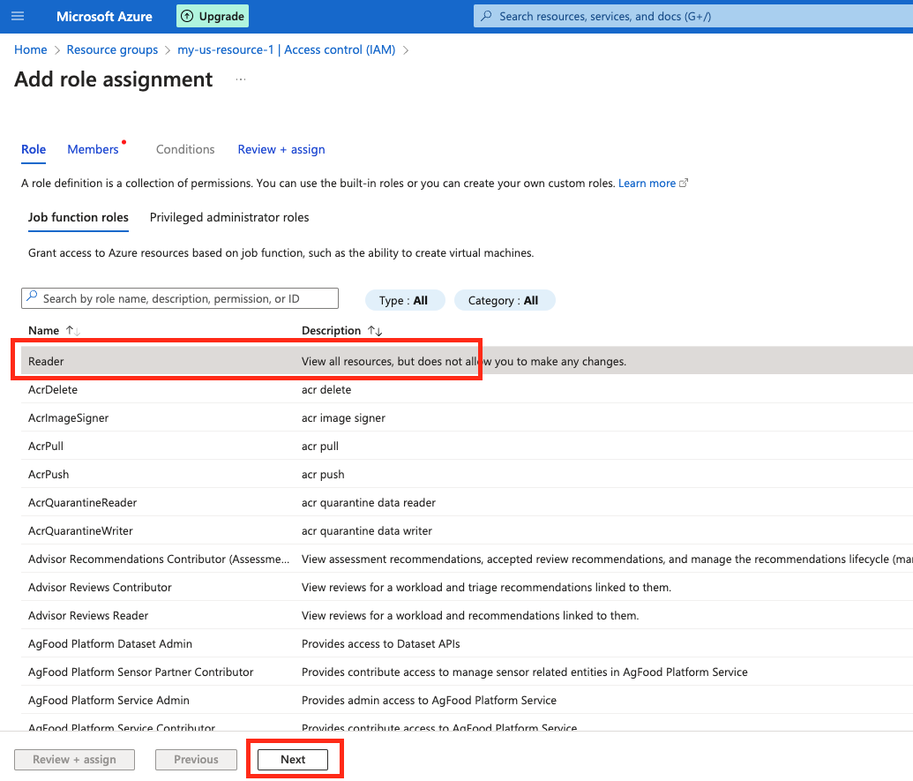

(2-6) Select [User, Group, Service Principal] and then click [Select Members].
(2-7) Check [Selected members] and click the [Select] button.
The [Review + Assignment] button becomes activated and click it.

> 💡 Selected members must have access to the selected resource group.

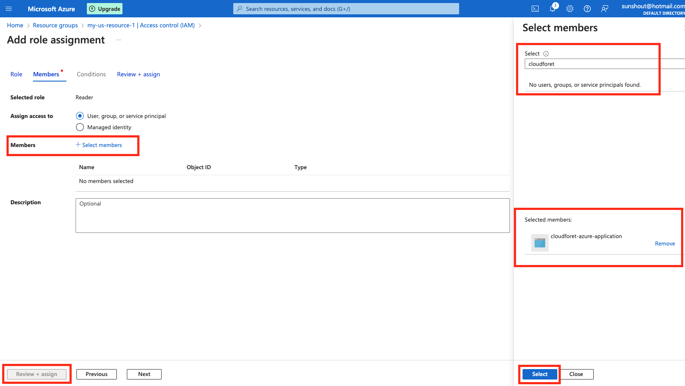

 
 

## 4. Generate authentication key

Authentication keys contain **credentials** information to access Azure resources.
You can obtain **[Client Secret]** setting information by creating an authentication key.

(1) Go to [Azure Portal](https://portal.azure.com/#home).
(1-1) Enter ‘app registration’ in the search box and click [app registration] in the service list.

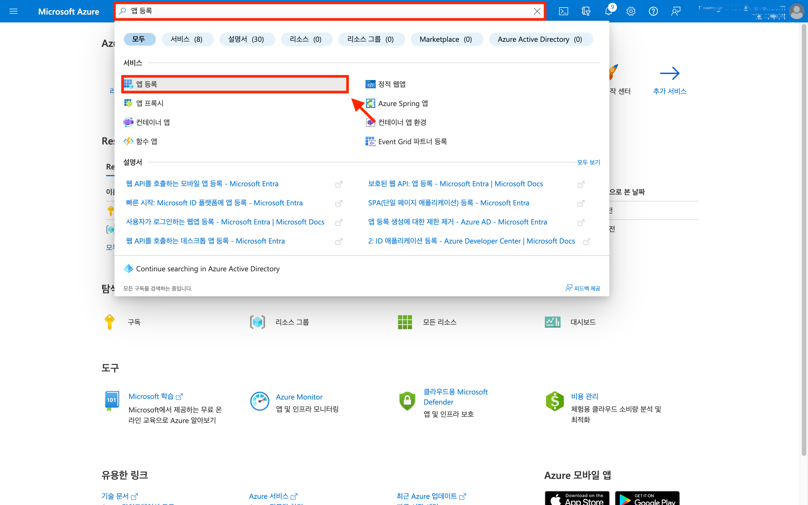

(2) Click the application for which you want to create an authentication key.

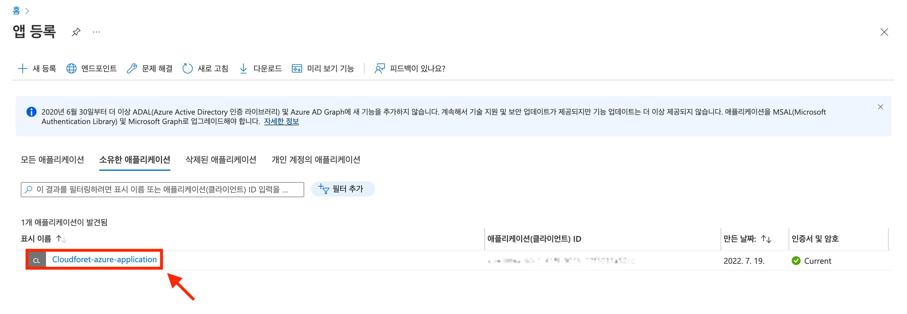

(3) Click the [Certificate & Secret > Client Secret] tab and then click the [New Client Secret] button.

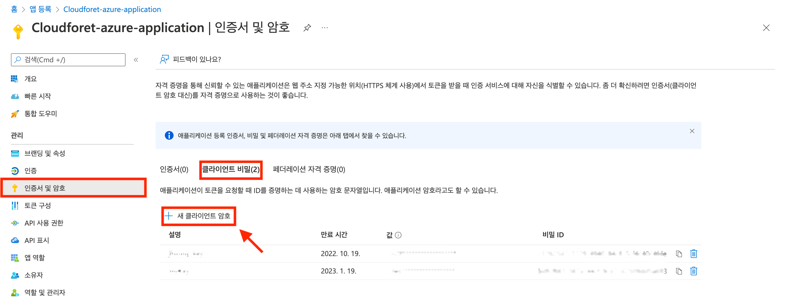

(3-1) Enter the description information and click the [Add] button.

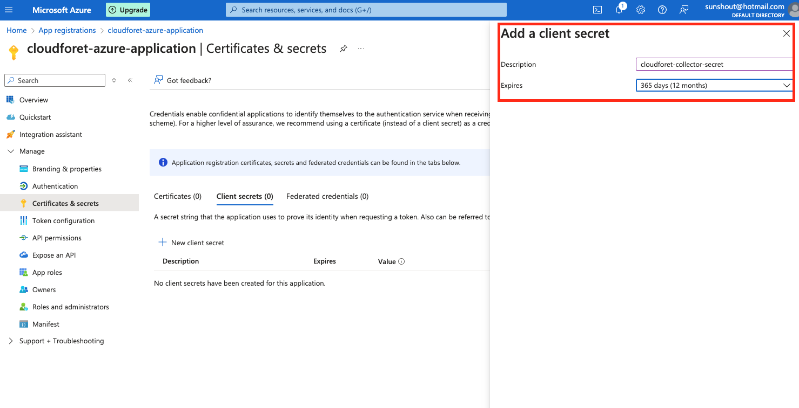

(3-2) Since you cannot see the generated password value again when moving the page, **note** the encryption key information.
The information in the [Value] column corresponds to the **[Client Secret]** setting information.

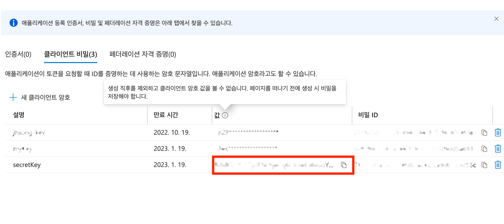

 
 

## 5. Check Subscription

This is the process of checking the **Subsciprtion ID**, which is the setup information required for the **[azure_client_secret]** method.
Cloudforet's user guide **does not include** the process of creating an Azure subscription.
For a guide to creating an Azure subscription, see [Azure Documentation](https://docs.microsoft.com/en-us/azure/cloud-adoption-framework/ready/azure-best-practices/initial-subscriptions).

(1) Go to [Azure Portal](https://portal.azure.com/#home).
(1-1) Enter ‘Subscription’ in the search box and click [Subscription] in the service list.

(1-2) Check the subscription ID information, which is the value corresponding to **[Subscription ID]**.

 
 

## 6. Register service account

Now you are ready to add Cloudforet service account.
You can register a service account using the setup information you obtained while going through the setup guide so far.
For detailed information on how to register a service account, see **[[Cloudforet User Guide]](https://cloudforet.io/docs/guides/asset-inventory/service-account/)** Please refer to .

(1) Setting information required for the **[azure_client_secret]** method.
Please enter the setting information below using direct input.

- **Subscription ID**
- **Tenant ID**
- **Client ID**
- **Client Secret**

(1-1) Click the [Save] button.

(2) Afterwards, how to create Cloudforet’s **collector plugin** is **[[Cloudforet’s User Guide]](https://cloudforet.io/docs/guides/asset-inventory/collector/)* Please see *.

## 7. Add custom role (optional)

(1) Go to subscription service.

(1-1) Select the [Access Control (IAM)] menu.

(1-2) Click the [Add] button.

(1-3) Click [Add custom role].

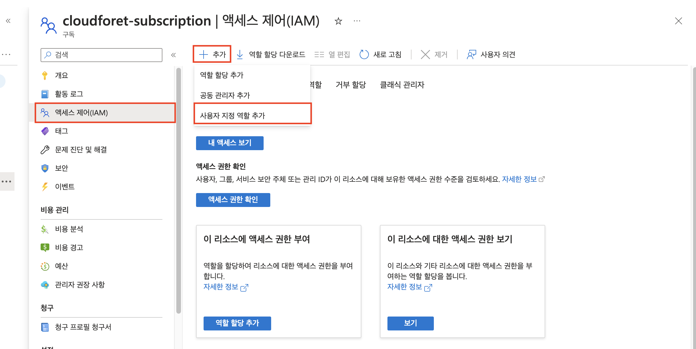

(2) Enter [spaceone_custom_role] in the custom role name.

(2-1) Click [Start from scratch] in the standard permissions.

(2-2) Click the [Next] button at the bottom left.

(3) Click [JSON] in the tab menu.

(3-1) Click the [Edit] button.

(3-2) In the code block, go to [properties > permissions > actions] and [in the document](https://github.com/cloudforet-io/plugin-azure-inven-collector#custom-roles-for-collecting-azure -cloud-resources) Add the permissions listed.

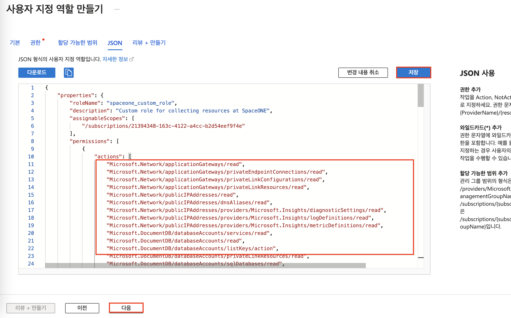

(3-3) Click the [Save] button.

(3-4) Click the [Next] button.

(4) After creating a custom role [3. Roles are assigned through the [Role Grant] (#3-Role-Grant) process.

