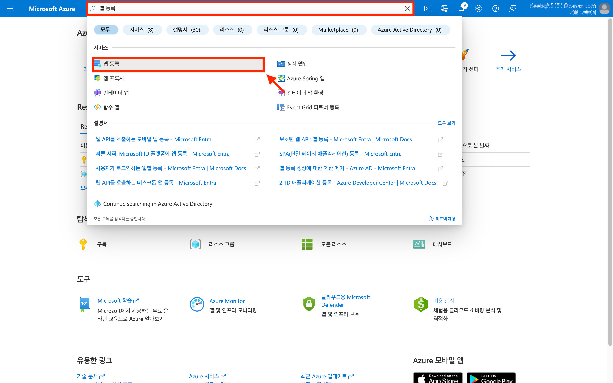
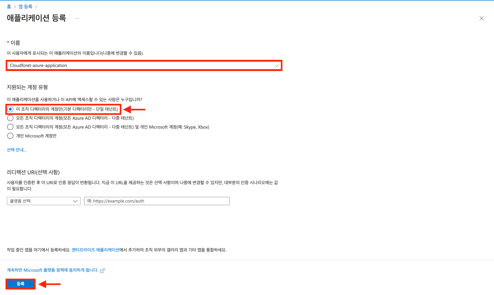
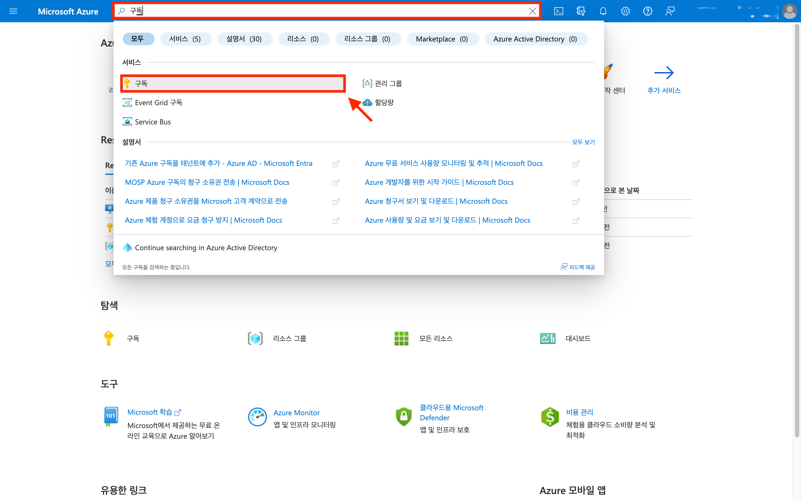
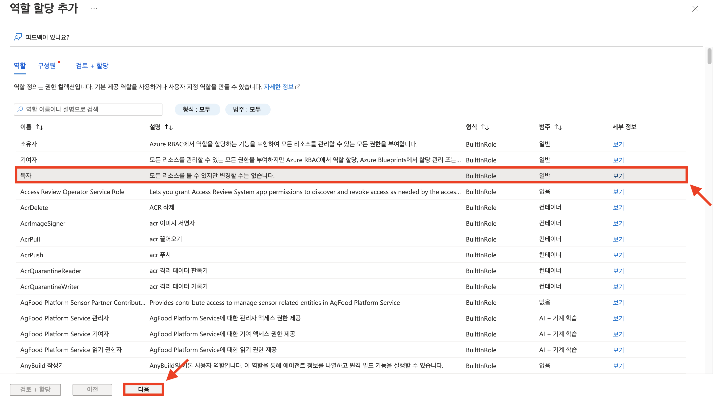
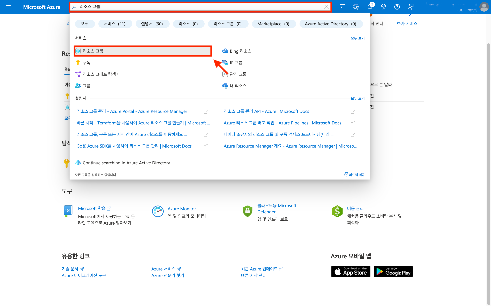
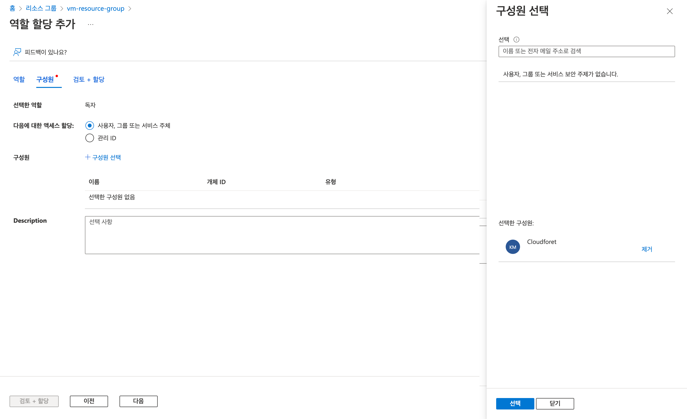
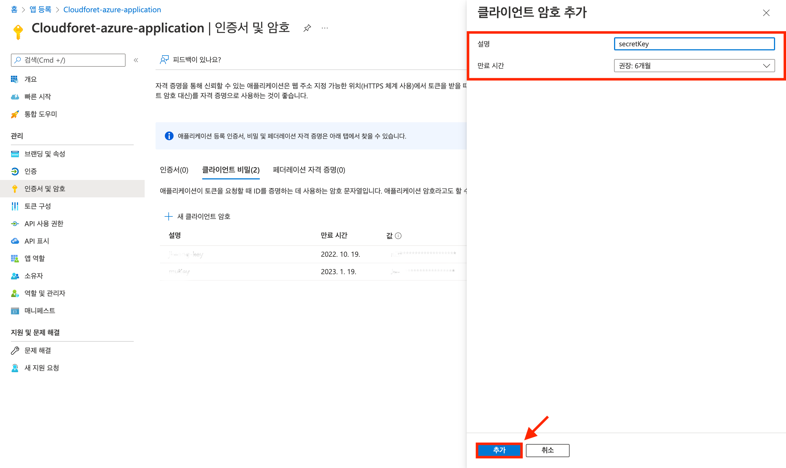
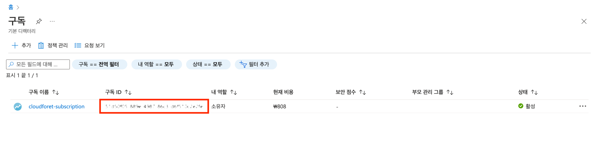
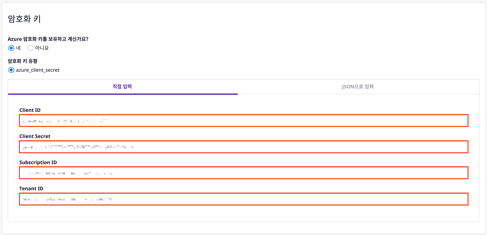
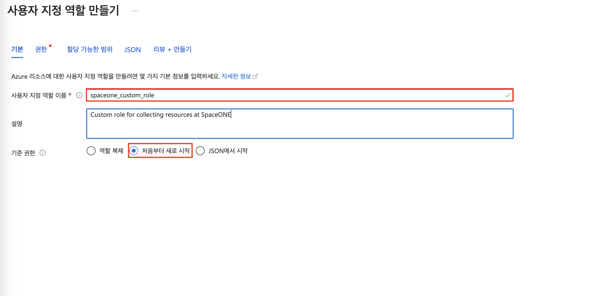

## 개요

클라우드포레에서 Azure 서비스 계정을 등록하기 위해서 아래 4가지 설정 정보가 필요합니다.

- **Subscription ID**
- **Tenant ID**
- **Client ID**
- **Client Secret**

>💡 설정 가이드를 시작하기에 앞서 **Subscription ID**가 생성되었는지 확인해 주십시오.  
Azure Subcription 생성 가이드는 [Azure Documentation](https://docs.microsoft.com/en-us/azure/cloud-adoption-framework/ready/azure-best-practices/initial-subscriptions)을 참고하십시오.
 

본 설정 가이드는 위에서 언급한 정보들이 무엇을 의미하고, 어디서 획득하는지 자세히 알아보도록 하겠습니다.

 

### Subscription ID

Azure는 구독(Subscription)이라는 Object 단위로 비용과 리소스를 관리합니다.  
이를 구별하는 **고유 식별자**가 **Subscription ID**입니다.  
Subscription에 대한 자세한 설명은 [Azure Documentation](https://docs.microsoft.com/en-us/azure/developer/intro/azure-developer-billing#what-is-an-azure-subscription)을 참고하십시오.

 

### Tenant ID

**Tenant ID**는 Azure Active Directory(AD)에서 제공되는 조직에 대한 **고유 식별자**입니다.   
Azure AD는 클라우드 기반 ID 및 액세스 관리 서비스이며 사용자를 조직 단위로 관리하기 위해 사용합니다.  
Azure AD에 대한 자세한 설명은 [Azure Documentation](https://docs.microsoft.com/en-us/azure/active-directory/fundamentals/active-directory-whatis)을 참고하십시오.

 

### Client ID

**Client ID**는 Azure 앱 생성 시 발급되는 Application ID입니다.   
Azure App은 어플리케이션에 대한 자격증명과 IAM 사용자를 관리하기 위해 사용합니다.   
Azure App에 대한 자세한 설명은 [Azure Documentation](https://docs.microsoft.com/en-us/azure/active-directory/develop/quickstart-register-app)을 참고하십시오.  

 

### Client Secret

Azure App 등록을 통해서 얻을 수 있는 **Client Secret** 키입니다.  
Azure의 API를 사용하고 리소스 접근을 위한 토큰 발급 시 필요합니다.

 

클라우드포레 Azure 서비스 계정 등록 시 필요한 설정 정보에 대한 개념을 간략히 알아보았습니다.  
이제, 실제로 **설정 정보를 획득하는 방법**에 대해 다음 과정에서 자세히 알아보도록 하겠습니다.

 

## 전체 Flow

클라우드포레에서는 Azure 연동에 대해 인증키 발급을 통한 **[azure_client_secret]** 방식을 지원합니다.  
**[azure_client_secret]** 을 이용한 방식은 아래와 같은 설정 정보가 필요합니다.

- **Subscription ID**
- **Tenant ID**
- **Client ID**
- **Client Secret**

위 정보를 획득하기 위해 다음과 같은 순서로 설정을 진행해주십시오.

1. [앱 등록](#1-앱-등록)
2. [리소스 그룹 생성](#2-리소스-그룹-생성)
3. [역할 부여](#3-역할-부여)
4. [인증키 생성](#4-인증키-생성)
5. [구독(Subscription) 확인하기](#5-구독Subscription-확인하기) 
6. [서비스 계정 등록](#6-서비스-계정-등록)
7. [사용자 지정 역할 추가(선택)](#7-사용자-지정-역할-추가-선택)

 
 

## 1. 앱 등록

앱 등록을 통해 Azure의 **[Client ID]** 설정 정보를 얻을 수 있습니다.  
만약 이미 등록한 앱이 존재한다면 생략할 수 있습니다.

(1) [Azure Portal](https://portal.azure.com/#home) 로그인합니다.  
(1-1) 검색창에 `앱 등록` 입력하여 [앱 등록]을 클릭합니다.

(1-2) [새 등록] 버튼을 클릭합니다.

(2) 애플리케이션 등록 정보를 입력합니다.  
(2-1) [이 조직 디텍터리의 계정만]을 클릭합니다.  
[선택안내]를 클릭하여 조직의 구조에 적합한 API에 액세스 가능한 계정을 선택할 수 있습니다.  
(2-2) [등록] 버튼을 클릭합니다.

(3) [기본 정보] 메뉴에서 **[Client ID]** 와 **[Tenant ID]** 설정 정보를 확인할 수 있습니다.

 
 

## 2. 리소스 그룹 생성

리소스 그룹은 Azure에서 사용하고 있는 리소스를 관리하기 위한 그룹입니다.  
구독과 1:N 관계를 맺을 수 있습니다.  
생성한 리소스 그룹이 있다면 이 과정을 생략하십시오.

(1) [Azure Portal](https://portal.azure.com/#home)로 이동합니다.
(1-1) 검색창에 `리소스 그룹` 입력하여 서비스 목록에있는 [리소스 그룹]을 클릭합니다.

(2) [만들기] 버튼을 클릭합니다.

(3) 프로젝트 정보를 입력한 후 [검토 + 만들기]버튼을 클릭합니다.  
(3-1) 이후 [만들기] 버튼을 클릭합니다.

 
 

## 3. 역할 부여

[역할](https://docs.microsoft.com/en-us/azure/role-based-access-control/role-definitions)은 Azure 리소스에 대한 접근 권한의 모임입니다.   
Azure 플러그인이 리소스 정보를 수집하기 위해 적절한 권한을 가진 역할 설정이 필요합니다.
> 사용자 지정 역할 생성을 통해 필요한 권한을 가진 역할을 생성할 수 있습니다.  
> [7번 과정](#7-사용자-역할-지정-추가-선택)에서 사용자 지정 역할을 생성하는 방법을 확인할 수 있습니다.

컬렉터 플러그인은 읽기 권한 이외의 어떠한 권한도 필요하지 않습니다.  
각 플러그인에서 필요한 권한 정보는 아래와 같습니다.

| Plugin                                   | URL |
|------------------------------------------| --- |
| Microsoft Azure Cloud Service Collector  | https://github.com/cloudforet-io/plugin-azure-inven-collector#authentication-overview |

플러그인이 리소스를 수집하기 위해 Azure 에서 권한을 부여하는 과정은 아래와 같습니다.

1. 구독에 역할 부여
2. 리소스 그룹에 역할 부여

(1) 구독에 역할 부여하는 과정입니다.  
(1-1)  [Azure Portal](https://portal.azure.com/#home)로 이동합니다.  
(1-2) 검색창에 `구독`  입력하여 서비스 목록에있는 [구독]을 클릭합니다.  

(1-3) 역할을 부여할 구독을 클릭합니다.

(1-4) [액세스 제어(IAM) > 추가 > 역할 할당 추가] 버튼을 클릭합니다.

(1-5) [독자] 역할을 클릭한 후 [다음] 버튼을 클릭합니다.

(1-6) [구성원 선택] 버튼을 클릭하여 구성원으로 어플리케이션을 선택합니다.  
(1-7) 구성원 추가 후 [선택] 버튼을 클릭합니다.   
[검토 + 할당] 버튼이 활성화되면 클릭합니다.

>💡 해당 아이콘을 가진 어플리케이션을 선택해 주십시오.  
> 

 

(2) 리소스 그룹에 역할 부여하는 과정입니다.
구독에 속해 있는 특적 리소스 그룹의 자원만 수집하고 싶다면 해당 리소스 그룹에 역할을 부여해야 합니다.
구독에 역할을 부여한 경우 이 과정은 생략할 수 있습니다.

(2-1) [Azure Portal](https://portal.azure.com/#home) 로그인합니다.  
(2-2) 검색창에 `리소스 그룹` 입력하여 서비스 목록에있는 [리소스 그룹]을 클릭합니다.  

(2-3) 권한을 부여할 리소스 그룹을 클릭합니다.

(2-4) [액세스 제어(IAM) > 추가 > 역할 할당 추가] 버튼을 클릭하여 액세스 권한 설정을 시작합니다.

(2-5) [독자] 권한을 선택 후 [다음] 버튼을 클릭합니다.

(2-6) [사용자,그룹, 서비스 주체]를 선택 후 [구성원 선택]을 클릭합니다.  
(2-7) [선택된 구성원]을 확인하고 [선택 ] 버튼을 클릭합니다.  
[검토 + 할당] 버튼이 활성화가 되며 해당 버튼을 클릭합니다.

> 💡 선택된 구성원은 선택한 리소스 그룹에 대한 접근 권한을 가지고 있어야 합니다.

 
 

## 4. 인증키 생성

인증키는 Azure 리소스에 접근하기 위한 **자격 증명** 정보를 가지고 있습니다.   
인증키 생성을 통해 **[Client Secret]** 설정 정보를 얻을 수 있습니다.

(1) [Azure Portal](https://portal.azure.com/#home)로 이동합니다.  
(1-1) 검색창에 `앱 등록` 입력하여 서비스 목록에있는 [앱 등록]을 클릭합니다.

(2) 인증키를 생성할 어플리케이션을 클릭합니다.

(3) [인증서 및 암호 > 클라이언트 비밀] 탭을 클릭한 후 [새 클라이언트 암호] 버튼을 클릭합니다.

(3-1) 설명 정보를 입력한 후 [추가] 버튼을 클릭합니다.

(3-2) 페이지 이동 시 생성된 암호 값을 다시 볼 수 없으니 암호키 정보를 **메모**합니다.   
[값] 칼럼에 있는 정보는 **[Client Secret]** 설정 정보에 해당합니다.

 
 

## 5. 구독(Subscription) 확인하기

**[azure_client_secret]** 방식에 필요한 설정 정보인 **Subsciprtion ID**를 확인하는 과정입니다.  
클라우드포레의 사용자 가이드는 Azure의 구독(Subscription) 생성 과정이 **포함되어있지 않습니다**.  
Azure 구독 생성 가이드는 [Azure Documentation](https://docs.microsoft.com/en-us/azure/cloud-adoption-framework/ready/azure-best-practices/initial-subscriptions)을 참고하십시오.

(1)  [Azure Portal](https://portal.azure.com/#home)로 이동합니다.  
(1-1) 검색창에 `구독` 입력하여 서비스 목록에있는 [구독]을 클릭합니다.

(1-2) **[Subscription ID]** 에 해당하는 값인 구독 ID 정보를 확인합니다.

 
 

## 6. 서비스 계정 등록

이제 클라우드포레의 서비스 계정 추가를 위한 준비가 끝났습니다.  
지금까지 설정 가이드를 진행하면서 얻은 설정 정보를 활용해 서비스 계정을 등록할 수 있습니다.  
서비스 계정 등록의 자세한 방법은 **[[클라우드포레 사용자 가이드]](https://spaceone.org/ko/docs/guides/asset-inventory/service-account/#%EC%84%9C%EB%B9%84%EC%8A%A4-%EA%B3%84%EC%A0%95-%EC%B6%94%EA%B0%80%ED%95%98%EA%B8%B0)** 를 참고하십시오.

(1) **[azure_client_secret]** 방식에 필요한 설정 정보입니다.   
직접 입력 방식을 통해 아래의 설정 정보를 입력해 주십시오.

- **Subscription ID**
- **Tenant ID**
- **Client ID**
- **Client Secret**

(1-1) [저장] 버튼을 클릭합니다.

(2) 이후 클라우드포레의 **컬렉터 플러그인** 생성 방법은 **[[클라우드포레의 사용자 가이드]](https://spaceone.org/ko/docs/guides/asset-inventory/collector/)** 를 참고하십시오.

## 7. 사용자 지정 역할 추가 (선택)

(1) 구독 서비스로 이동합니다.

(1-1) [액세서 제어(IAM)] 메뉴를 선택합니다.

(1-2) [추가] 버튼을 클릭합니다.

(1-3) [사용자 지정 역할 추가]을 클릭합니다.

(2) 사용자 지정 역할 이름에 [spaceone_custom_role]을 입력합니다.

(2-1) 기준 권한에서 [처음부터 새로 시작]을 클릭합니다.

(2-2) 왼족 하단에 [다음] 버튼을 클릭합니다.

(3) 탭 메뉴에서 [JSON]을 클릭합니다.

(3-1) [편집] 버튼을 클릭합니다.

(3-2) 코드블럭에서 [properties > permissions > actions]에 [문서에](https://github.com/cloudforet-io/plugin-azure-inven-collector#custom-roles-for-collecting-azure-cloud-resources) 적힌 권한들을 추가합니다.

(3-3) [저장] 버튼을 클릭합니다.

(3-4) [다음] 버튼을 클릭합니다.

(4) 사용자 지정 역할을 생성 후 [3. 역할 부여](#3-역할-부여) 과정을 통해 역할을 부여합니다.
